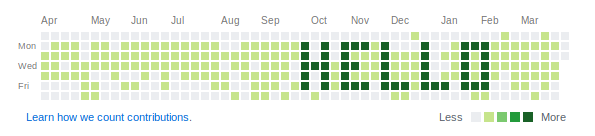

# GitHubTicker

[](https://github.com/whlk)

Allows you to write something on your GitHub account activity overview.

## Setup

 1) [Fork this repository](https://github.com/whlk/GitHubTicker/fork) (it can be a private repository)
 2) Clone it on a computer that is running every day:
    ```
    git clone git@github.com:[yourusername]/GitHubTicker.git
    cd GitHubTicker/
    ```
 3) create a [`text.txt`](text.txt) file in the repository directory with your ticker text:
 
    * Whitespace signifies that nothing should be commited on this day (light parts of the activity overview)
    * Every non-whitespace character signifies that a commit should be produced on this day (dark parts of the activity overview)
    * The file must have at most seven lines
    * Each line can have arbitrary length, but the longer the lines the longer the script has to run in order to show the full text
    * See [`text.sample.txt`](text.sample.txt) for a sample
    ```

    x x xxx x   x   x   xxx 
    x x x   x   x   x   x x
    xxx xx  x   x   x   x x
    x x x   x   x   x   x x
    x x xxx xxx xxx xxx xxx

    ```
    
 4) Compile the project via `./gradlew shadowJar`
    
    Or you can use a prebuild jar from [the official releases](https://github.com/whlk/GitHubTicker/releases/latest).
 5) Test if your text file is correct and how long it will take to finish printing:
    ```
    java -jar build/libs/GitHubTicker.jar -v -d
    ```
    > To see what the command line options mean use
    >  
    > ```java -jar build/libs/GitHubTicker.jar --help``` 
    
 6) Make sure that you can push changes to the repository:
    ```
    git push --dry-run
    ```
    > You might have to [set up a GitHub SSH Key](https://help.github.com/en/articles/generating-a-new-ssh-key-and-adding-it-to-the-ssh-agent)
 7) Create a cronjob running once a day:
    ```
    @daily cd /var/projects/GitHubTicker && /usr/bin/java -jar build/libs/GitHubTicker.jar -v -f text.txt
    ```
 8) Make sure that the user running the cronjob (probably `root`) has permissions to execute the job
 9) A `githubticker.properties` file will be created containing start date of the script and when the last commit check occurred. If you accidental run the script (without the `-d` option) make sure to reset this file.
 10) Profit!  
 
## License

See the [LICENSE](LICENSE) file for license rights and limitations (GNU).
